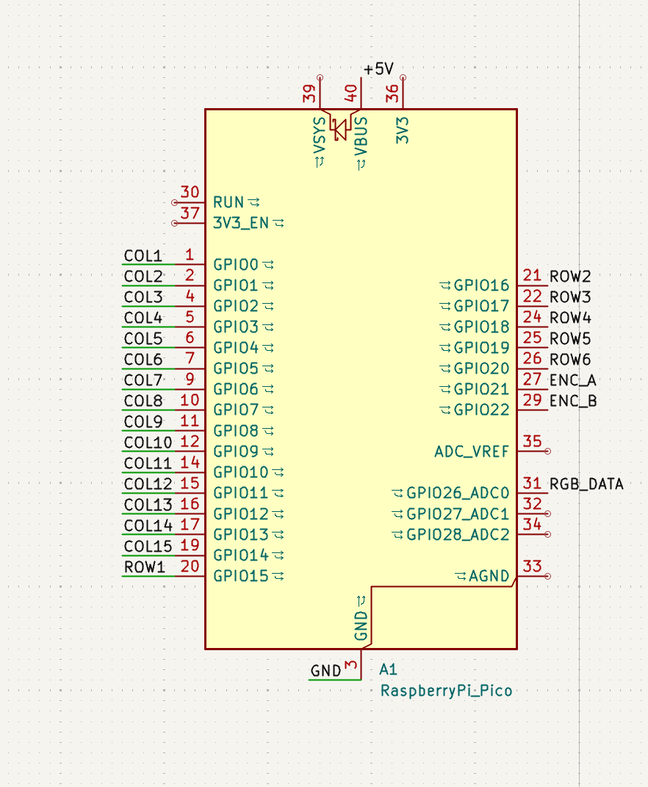
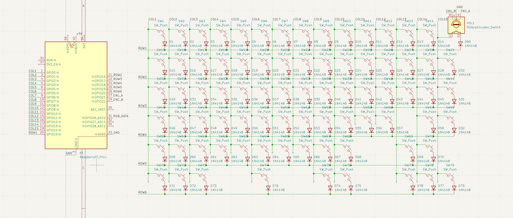
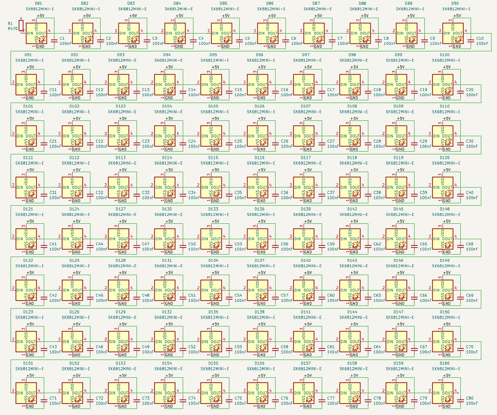
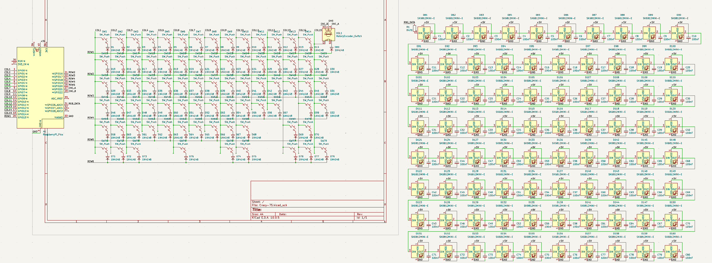

## 6 September 2026 — Finishing the Schematic and Correcting Footprints

**Time spent: ~2h 30min**

### Returning to the schematic

After returning from vacation, I continued working on the Crazy-75 schematic.

I first connected the Raspberry Pi Pico-compatible RP2040 controller to the keyboard matrix. The current matrix uses 6 rows and 15 columns, so I assigned the GPIOs as follows:

- GP0–GP14 → COL1–COL15
- GP15–GP20 → ROW1–ROW6
- GP21 → rotary encoder A
- GP22 → rotary encoder B
- GP26 → RGB data
- GP27 and GP28 remain unused

The rotary encoder push switch is part of the keyboard matrix, so it does not require another dedicated GPIO.

### Pico power and USB

I checked the pinout of the RP2040 Pico-compatible board I selected for the project. It exposes the standard 26 GPIO pins and has SWD debug pads, but does not expose USB D+ and D- separately.

Because of this, using a separate USB-C connector on the keyboard PCB would add unnecessary complexity. I decided to use the USB-C connector already present on the Pico-compatible board despite power-draw concerns caused by the 80 LEDs. 

The +5 V rail for the RGB LEDs is connected to VBUS. I also connected AGND to GND.

The RGB brightness will need to be limited in firmware because 80 SK6812 MINI-E LEDs could draw far too much current if all LEDs were driven at maximum brightness.

### Comparing the design with another KEEB keyboard

I looked through the Tap65 project, another custom keyboard funded through Hack Club KEEB, to compare its design with mine.

This turned out to be very useful. The project made me realise that I had used generic switch symbols/footprints rather than footprints intended for the Kailh hot-swap sockets I plan to use.

It also highlighted how important it is to verify the SK6812 MINI-E pinout and footprint before manufacturing, since an incorrect LED footprint/pin mapping can make the RGB chain unusable.

### Installing marbastlib

I went back to the ebastler KiCad repository to install the keyboard-specific library.

At first I accidentally installed the **Connect-traces** plugin. When I still could not find the keyboard symbols and footprints I was looking for, I realised that I actually needed to install the **marbastlib** library separately.

After installing marbastlib, the correct keyboard-specific symbols and footprints became available.

### Correcting the switch footprints

I replaced the existing switch setup with the marbastlib Kailh hot-swap MX footprints for CPG151101S11 sockets.

Changing the switch symbols caused the existing electrical connections to be lost, so I had to reconnect the switches to the matrix and their diodes.

This took some extra work, but the schematic now matches the type of hot-swap sockets that will actually be used on the PCB.

### Verifying the RGB LEDs

I also changed/verified the SK6812 MINI-E setup using the marbastlib resources.

The RGB system currently consists of:

- 80 × SK6812 MINI-E LEDs
- 80 × 100 nF decoupling capacitors
- one 470 Ω resistor before the first LED
- +5 V and GND distribution
- a daisy chain from DOUT of each LED to DIN of the next LED
- RGB_DATA from GP26

The LED symbols did not visibly change when changing them, but the correct library resources and footprints are now assigned.

### Rotary encoder

I verified the previously selected EC11 rotary encoder and assigned its footprint.

The encoder will control volume, with its push button intended for mute/unmute.

Its rotation pins use GP21 and GP22, while the push button is connected through the keyboard matrix.

### Stabilizers

I found a cheaper set of well-reviewed PCB-mount screw-in stabilizers and updated the BOM.

The layout requires stabilizers for:

- Backspace
- Enter
- Left Shift
- 6.25u Spacebar

I added the corresponding stabilizer footprints to the schematic. Since stabilizers are purely mechanical, they do not require electrical connections.

I also investigated lubricating the stabilizers. GPL205 is available in 10 g jars for around €10. This is much more lubricant than one keyboard needs, so I have not decided yet whether it is worth including in the funded BOM or buying separately.

### BOM updates

I updated the BOM with the newly selected screw-in stabilizers and the other component decisions made today.

At this point, every component in the schematic has a footprint assigned and all electrical components are connected.

### Current schematic

The schematic is now much closer to being ready for PCB layout.

### Next steps

- Run KiCad ERC and investigate any warnings/errors
- Do a final check of component pinouts and footprints
- Transfer the schematic to PCB Editor
- Import/recreate the physical keyboard layout
- Determine the best location and orientation for the Pico module
- Place stabilizers, hot-swap sockets, LEDs, diodes and capacitors
- Begin PCB routing

---

## 27 August 2026 — Starting the PCB Schematic

**Time spent: ~1h 10min**

### Starting the schematic

Today I started designing the keyboard PCB in KiCad.

I began by adding the first rows of keyboard switches, their 1N4148 diodes, and the EC11 rotary encoder to the schematic.

Initially, I arranged the switches roughly according to their physical positions based on my design from yesterday. This made sense to me at first because it made the schematic resemble the actual keyboard layout.

**Initial schematic layout:**

After looking more closely at the KEEB guide, I realized that the schematic does not need to represent the physical position of the components. Its purpose is to clearly describe how the components are electrically connected.

I therefore reorganized the switches into a grid representing the keyboard matrix. This makes the rows and columns much easier to see and should make connecting the matrix to the microcontroller easier later.

### Keyboard matrix

I currently have the 80 switches organized into **6 rows and 15 columns**, with one 1N4148 diode for every switch.

I connected the switches into their respective rows and columns and kept unused matrix positions empty where the physical keyboard does not have a key.

I also added the EC11 rotary encoder to the schematic. It will eventually be used for volume control, with the integrated push button planned for mute/unmute.

**Current schematic:**

Fun fact about me: I never listen to music while working because I find it distracting.
### Next steps

- Check the matrix for incorrect or missing connections
    
- Add the Raspberry Pi Pico-compatible RP2040 controller
    
- Assign GPIO pins to the matrix rows and columns
    
- Connect the rotary encoder
    
- Add the SK6812 MINI-E RGB circuit
    
- Continue following the KEEB schematic design guide

---

## 26 August 2026 - Specification and Layout
**Time spent: ~1 hour**

### What I did

Today I finalized the main specifications for the keyboard and created the first version of the physical layout.

I also cleaned up the GitHub repository by adding `.obsidian/` to `.gitignore`. This keeps my local Obsidian configuration out of the public repository while still allowing me to use Obsidian to write the project documentation.

### Finalized specifications

- Approximately 75% layout
    
- ANSI physical layout
    
- US QWERTY
    
- Dedicated F1–F12 keys
    
- Dedicated arrow keys
    
- Dedicated `Delete`, `Home` and `End`
    
- One programmable `M1` key
    
- Rotary encoder for volume control and mute
    
- MX 5-pin switch support
    
- Hot-swappable switches
    
- Per-key RGB using `SK6812 MINI-E` LEDs
    
- 3D-printed case
    
- Internal dampening

### Keyboard layout

I designed the physical layout using Keyboard Layout Editor. I used a conventional 75% keyboard as a starting point but removed keys I don't expect to use, such as `Page Up` and `Page Down`.

I kept `Home` and `End` because I expect them to be useful for navigating text and code. The remaining position in the navigation column became an `M1` key whose function will be decided later.

The rotary encoder is located in the top-right corner and is currently planned to control volume, with pressing the encoder muting/unmuting the computer.

This keyboard layout contains 80 MX style switches + the rotary encoder. 

**Final layout:**

The editable Keyboard Layout Editor data is stored at:

`Layout/keyboard-layout.json`

### Next steps

- Finish the BOM
- Begin work in KiCad

### Initial BOM and component sourcing

**Time spent: ~1 hour**

Continued completing the BOM.

I found candidates for:
- Stabilizers
- 1N4148 through-hole diodes
- SK6812 MINI-E RGB LEDs
- EC11 rotary encoder
- RP2040 Raspberry Pi Pico-compatible controller

I compared several RP2040 boards And ultimately landed on one with the same dimensions and pinout as a classic RP2040 Pi pico to avoid complications in the future. 

I recorded quantities, prices before checkout and purchase links in the BOM.

The remaining major parts to source include switches and keycaps as well as the dampening material, but these can wait while I design the PCB.

### Next step
- Begin work in KiCad

---

## 25.08

**Time spent: 1h**

### What I did

Started planning my keyboard and decided on the main
requirements.

### Decisions

- 75% layout
- ANSI
- US QWERTY
- MX 5-pin switches
- Kailh hot-swap sockets
- Per-key RGB using `SK6812 MINI-E`
- 3D-printed case

### Hot-swap socket research

I looked at several options and selected...

### Problems / things to investigate

- [ ] Decide mounting system

### Next steps

Finalize the exact key layout and begin the schematic.

**Repository setup - 45 min**  
Created the GitHub repository for the project and set it up as an Obsidian vault. Created the initial README and development journal, configured standard Markdown links for GitHub compatibility, and organized the repository for future PCB, CAD and image files.

---
